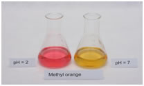

## Theory 

  It is needless to emphasize the importance of water in our life. Without water, there is no life on our planet. 
  We need water for different purposes such as drinking, industries, irrigation, swimming, fishing, etc.

  Water for different purposes has its own requirements for composition and purity. Each body of water needs 
  to be analysed on a regular basis to confirm suitability. The types of analysis could vary from simple field 
  testing for a single analyte to laboratory-based multi-component instrumental analysis. The measurement of 
  water quality is a very exacting and time-consuming process, and a large number of quantitative analytical 
  methods are used for this purpose.

<h2>Total Hardness</h2>

<h3>Theory</h3>

  Hardness in water is that characteristic which “prevents the lathering of soap”. This is due to the presence 
  of certain salts of calcium, magnesium, and other heavy metals dissolved in it. A sample of hard water, when 
  treated with soap, does not produce lather but instead forms a white scum or precipitate. This precipitate 
  results from the formation of insoluble soaps of calcium and magnesium.

  Thus, water which does not produce lather with soap solution readily but forms a white curd is called 
  <strong>hard water</strong>. On the other hand, water which lathers easily on shaking with soap solution is 
  called <strong>soft water</strong>. Such water does not contain dissolved calcium and magnesium salts.

<h3>Types of Hardness</h3>

<h4>Temporary or Carbonate Hardness</h4>

  Caused by dissolved bicarbonates of calcium, magnesium, and other heavy metals and carbonates of iron. 
  Temporary hardness is mostly removed by boiling, which decomposes bicarbonates into insoluble carbonates 
  or hydroxides that settle as a crust.

<h4>Permanent or Non-Carbonate Hardness</h4>

  Caused by chlorides and sulphates of calcium, magnesium, iron, and other heavy metals. This type of hardness 
  cannot be removed by boiling.

<h3>Classification of Hardness</h3>
<table cellpadding="6" cellspacing="0">
  <thead>
    <tr>
      <th>Water Type</th>
      <th>CaCO3 Concentration (mg/L)</th>
    </tr>
  </thead>
  <tbody>
    <tr>
      <td>Soft</td>
      <td>0–60 mg/L</td>
    </tr>
    <tr>
      <td>Medium</td>
      <td>60–120 mg/L</td>
    </tr>
    <tr>
      <td>Hard</td>
      <td>120–180 mg/L</td>
    </tr>
    <tr>
      <td>Very Hard</td>
      <td>&gt;180 mg/L</td>
    </tr>
  </tbody>
</table>

<h3>Determination of Hardness</h3>

  In a hard water sample, the total hardness can be determined by titrating the Ca2+ and 
  Mg2+ present in an aliquot of the sample with Na2EDTA solution using NH4Cl–
  NH4OH buffer solution of pH 10 and Eriochrome Black-T as the metal indicator.

<pre>
Na₂H₂Y (Disodium EDTA solution) → 2Na⁺ + H₂Y⁻

Mg²⁺ + HD²⁻ (blue) → MgD (wine red) + H⁺

D (metal-indicator complex, wine red colour) + H₂Y⁻ → Y⁻ (metal EDTA complex, colourless) + HD⁻ (blue colour) + H⁺
</pre>

  Ethylenediamine tetra-acetic acid (EDTA) and its sodium salts form a chelated soluble complex when added to 
  a solution of certain metal cations. If a small amount of a dye such as Eriochrome Black-T is added to an 
  aqueous solution containing calcium and magnesium ions at a pH of 10 ± 0.1, the solution turns wine red. 
  Upon adding EDTA as a titrant, the calcium and magnesium ions are complexed, and the solution changes from 
  wine red to blue at the end point of the titration.

<h3>Units of Hardness</h3>
<ol>
  <li><strong>Parts per million (ppm):</strong> Parts of calcium carbonate equivalent hardness per 10⁶ parts of water.  
       1 ppm = 1 part of CaCO₃ eq hardness in 10⁶ parts of water.</li>
  <li><strong>Milligram per litre (mg/L):</strong> mg of CaCO₃ equivalent hardness per litre of water.  
       1 mg/L = 1 mg of CaCO₃ eq hardness per L of water.</li>
  <li><strong>Clarke’s degree (°Cl):</strong> Number of grains (1/7000 lb) of CaCO₃ eq hardness per gallon (10 lb) of water.  
       1 °Cl = 1 grain of CaCO₃ eq hardness per gallon of water.</li>
  <li><strong>Degree French (°Fr):</strong> Parts of CaCO₃ eq hardness per 10⁵ parts of water.  
       1 °Fr = 1 part of CaCO₃ hardness eq per 10⁵ parts of water.</li>
</ol>

<h3>Relationship Between Various Units of Hardness</h3>
<ul>
  <li>1 ppm = 1 mg/L = 0.1 °Fr = 0.07 °Cl</li>
  <li>1 mg/L = 1 ppm = 0.1 °Fr = 0.07 °Cl</li>
  <li>1 °Cl = 1.43 °Fr = 14.3 ppm = 0.7 mg/L</li>
  <li>1 °Fr = 10 ppm = 10 mg/L = 0.7 °Cl</li>
</ul>

$$\text{Total hardness as } \mathrm{CaCO_3} \, (\text{ppm}) = \frac{\text{Vol. of EDTA (mL)} \times 0.1 \times \text{molarity of EDTA} \times 10^6}{\text{Vol. of the sample (mL)}}$$

<h2>Alkalinity</h2>

<h3>Theory:</h3>

Alkalinity is an aggregate property of the water sample which measures the acid-neutralizing capacity of a water sample. 
It can be interpreted in terms of specific substances only when a complete chemical composition of the sample is also performed. 
The alkalinity of surface water is due to the carbonate, bicarbonate, and hydroxide content and is often interpreted in terms 
of the concentrations of these constituents. Higher the alkalinity, greater is the capacity of water to neutralize acids. 
Conversely, the lower the alkalinity, the lesser will be the neutralizing capacity.

Alkalinity of a sample can be estimated by titration with standard H2SO4 or HCl solution. 
Titration to pH 8.3 or decolourisation of phenolphthalein indicator will indicate complete neutralization of OH− 
and 1/2 of CO32−, while titration to pH 4.5 or a sharp change from yellow to orange using 
methyl orange indicator will indicate total alkalinity.

To detect the different types of alkalinity, the water is tested for phenolphthalein and total alkalinity, using Equations: 

$$\text{Phenolphthalein alkalinity} \left( \frac{\text{mg}}{\text{L}} \text{ as } \mathrm{CaCO_3} \right) = \frac{A \times \text{Normality of acid} \times 50,000}{\text{mL of sample}}$$

$$\text{Total alkalinity} \left( \frac{\text{mg}}{\text{L}} \text{ as } \mathrm{CaCO_3} \right) = \frac{B \times \text{Normality of acid} \times 50{,}000}{\text{mL of sample}}$$

<h3>Where</h3>
<strong>A</strong> = titrant (mL) used to titrate to pH 8.3 
<strong>B</strong> = titrant (mL) used to titrate to pH 4.5 
<strong>N</strong> = normality of the acid (0.02N H2SO4 for this alkalinity test) 
<strong>50,000</strong> = a conversion factor to change the normality into units of CaCO3 

Once PA and TA are determined, then three types of alkalinities, i.e., hydroxides, carbonates and bicarbonates can be easily calculated from the table:

<table cellpadding="8" cellspacing="0">
  <thead>
    <tr>
      <th>Result of Titration</th>
      <th>OH alkalinity as CaCO3</th>
      <th>CO3 alkalinity as CaCO3</th>
      <th>HCO3 alkalinity as CaCO3</th>
    </tr>
  </thead>
  <tbody>
    <tr>
      <td>PA = 0</td>
      <td>0</td>
      <td>0</td>
      <td>TA</td>
    </tr>
    <tr>
      <td>PA &lt; 1/2 TA</td>
      <td>0</td>
      <td>2PA</td>
      <td>TA - 2PA</td>
    </tr>
    <tr>
      <td>PA = 1/2 TA</td>
      <td>0</td>
      <td>2PA</td>
      <td>0</td>
    </tr>
    <tr>
      <td>PA &gt; 1/2 TA</td>
      <td>2PA - TA</td>
      <td>2(TA - PA)</td>
      <td>0</td>
    </tr>
    <tr>
      <td>PA = TA</td>
      <td>TA</td>
      <td>0</td>
      <td>0</td>
    </tr>
  </tbody>
</table>

<h3>Chemical Oxygen Demand (COD)</h3>

<h4>Theory</h4>

COD is used as a measure of oxygen equivalent to organic matter content of a sample that is susceptible to oxidation by a strong chemical oxidant. For samples from a specific source, COD can be related empirically to BOD. COD determination has advantage over BOD determination in that the result can be obtained in about 5 hours as compared to 5 days required for BOD test.

The organic matter gets oxidized completely by K2Cr2O7 in the presence of H2SO4 to produce CO2 and H2O. The excess of K2Cr2O7 remaining after the reaction is titrated with ferrous ammonium sulphate. The dichromate consumed gives the O2 required for oxidation of organic matter.

$$COD \left( \frac{mg}{L} \right) = \frac{\text{Vol. of FAS for sample} \times \text{Normality of FAS} \times 8000}{\text{Vol. of sample}}$$

<h3>DRINKING WATER QUALITY STANDARDS:</h3>

<table style="border-collapse: collapse;">
  <tr>
    <th>Sl. No.</th>
    <th>Characteristic/Parameter</th>
    <th>BIS</th>
    <th>ICMR</th>
    <th>WHO</th>
  </tr>
  <tr><td>1</td><td>Colour</td><td>5</td><td>2.5</td><td>-</td></tr>
  <tr><td>2</td><td>Odour</td><td>Agreeable</td><td>Unobjectionable</td><td>Unobjectionable</td></tr>
  <tr><td>3</td><td>Turbidity</td><td>10 NTU</td><td>5 NTU</td><td>2.5 NTU</td></tr>
  <tr><td>4</td><td>pH</td><td>6.5-8.5</td><td>7.0-85</td><td>7.0-8.5</td></tr>
  <tr><td>5</td><td>TDS</td><td>500 mg/l</td><td>500 mg/l</td><td>500 mg/l</td></tr>
  <tr><td>6</td><td>Hardness</td><td>300 mg/l</td><td>300 mg/l</td><td>200 mg/l</td></tr>
  <tr><td>7</td><td>Ca</td><td>75 mg/l</td><td>75 mg/l</td><td>75 mg/l</td></tr>
  <tr><td>8</td><td>Mg</td><td>30 mg/l</td><td>50 mg/l</td><td>30 mg/l</td></tr>
  <tr><td>9</td><td>Cl</td><td>250 mg/l</td><td>200 mg/l</td><td>200 mg/l</td></tr>
  <tr><td>10</td><td>Sulphate</td><td>200 mg/l</td><td>200 mg/l</td><td>200 mg/l</td></tr>
  <tr><td>11</td><td>Fe</td><td>0.3 mg/l</td><td>0.1 mg/l</td><td>0.1 mg/l</td></tr>
  <tr><td>12</td><td>Nitrate</td><td>45 mg/l</td><td>20 mg/l</td><td>45 mg/l</td></tr>
  <tr><td>13</td><td>Phenolic compounds</td><td>0.001 mg/l</td><td>0.001 mg/l</td><td>0.001 mg/l</td></tr>
  <tr><td>14</td><td>Cd, Sc</td><td>0.01 mg/l</td><td>-</td><td>0.01 mg/l</td></tr>
  <tr><td>15</td><td>Cu, As</td><td>0.05 mg/l</td><td>0.05 mg/l</td><td>0.01 mg/l</td></tr>
  <tr><td>16</td><td>Cyanides</td><td>0.05 mg/l</td><td>-</td><td>0.01 mg/l</td></tr>
  <tr><td>17</td><td>Pb</td><td>0.1 mg/l</td><td>-</td><td>0.01 mg/l</td></tr>
  <tr><td>18</td><td>Anionic detergents</td><td>0.2 mg/l</td><td>-</td><td>-</td></tr>
  <tr><td>19</td><td>PAH</td><td>-</td><td>-</td><td>-</td></tr>
  <tr><td>20</td><td>Residual Chlorine</td><td>0.2 mg/l</td><td>-</td><td>-</td></tr>
  <tr><td>21</td><td>Pesticides</td><td>Absent</td><td>-</td><td>-</td></tr>
</table>

<strong>BIS</strong> – Bureau of Indian Standards.

<strong>ICMR</strong> – Indian Council for Medical Research.

<strong>WHO</strong> – World Health Organization.

